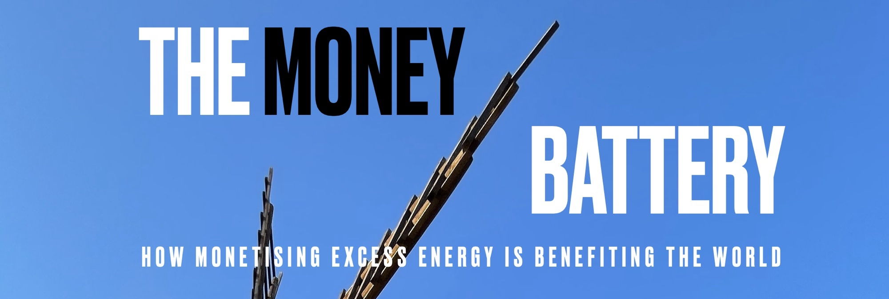

# List of References

This is a collection of concrete examples of energy monetisation around the world. It's a bullet-point version of a blog post
[The Machine that Turns Energy into Money](https://www.soundopcodes.dev/post/the-weird-economics-of-timestamping).

[1. General Resources](#1-general-resources)  
[2. Balance energy grids](#2-balance-energy-grids)  
[3. Finance energy projects](#3-finance-energy-projects)  
[4. Create incentives to capture methane](#4-create-incentives-to-collect-nasty-stuff)  
[5. Reduce heating bills](#5-reduce-heating-bills)  
[6. Non sustainable uses of mining](#6-non-sustainable-uses-of-timestamping)

## 1. General resources:

- [Understanding Proof of Work - A non technical introduction to bitcoin mining and its implications for investors](https://www.fidelitydigitalassets.com/research-and-insights/understanding-proof-work) Paper by Fidelity Digital Assets.
- [Chapter 10 - Mining and Consensus](https://github.com/bitcoinbook/bitcoinbook/blob/develop/ch10.asciidoc) Technical explanation of Bitcoin mining in *Mastering Bitcoin* by Andreas Antonopoulos.
- [Bitcoin Mining Council H1 2023 presentation](https://bitcoinminingcouncil.com/wp-content/uploads/2023/08/BMC-H1-2023-Presentation.pdf) Latest energy data collected by the Bitcoin Mining Council
- [Cambridge Bitcoin energy usage estimate](https://ccaf.io/cbnsi/cbeci) University of Cambridge estimated lower-upper bounds for Bitcoin network electricity consumption.
- [Cambridge Bitcoin CO2 emission compared](https://ccaf.io/cbnsi/cbeci/ghg/comparisons) Comparaison of Bitcoin emissions with other industries and global share.
- [How Bitcoin Mining Can Transform the Energy Industry](https://k33.com/research/reports/industry-reports/how-bitcoin-mining-can-transform-the-energy-industry) Report published in September 2022 by K33 Research (formerly Arcane Research). Requires Google sign-in.
- [Geopolitics and Bitcoin Mining](https://cryptocurrencymining.group/wp-content/uploads/2023/05/ID_Market_Insights_Geopolitics-BTC-Mining-230512.pdf) Report by [@BTCMiningGroup](https://twitter.com/BTCMiningGroup) on the state of Bitcoin mining around the world, 12 May 2023. 
  - [Twitter thread summary of the report](https://twitter.com/DenisRusinovich/status/1657448398386089986?s=20)

## 2. Balance energy grids 

Backgrounders:
- [The Energy Academy](https://platform.modo.energy/phase/channels?wchannelid=wy5tng1x36) Maintained by UK company Modo.

### 2.1 Grid balancing in Texas

ERCOT:

 - [what is curtailment](https://youtu.be/9ISSe8A3pVc?t=1132) Bitcoin mining council Q2 2022.
 - [Economic incentives](https://youtu.be/9ISSe8A3pVc?t=1370) Bitcoin mining council Q2 2022.
 - [selling back to the grid](https://youtu.be/9ISSe8A3pVc?t=1466) Bitcoin mining council Q2 2022
 - [Demand-response types of contract](https://youtu.be/9ISSe8A3pVc?t=1466) Pierre Rochard speaking at Surfing Bitcoin 2022.
 - [Negative electricity prices](https://youtu.be/oS1FGdngXVs?t=5987) Jaran Mellerud speaking at Surfing Bitcoin 2022.
 - [Les mineurs de bitcoin américains soulagent le réseau électrique pendant la vague de froid](https://www.cointribune.com/les-mineurs-de-bitcoin-americains-soulagent-le-reseau-electrique-pendant-la-vague-de-froid) January 2024 article from Cointribune giving an example of how the Texas grid protects itself by switching off miners in winter. 

### 2.2 Grid balancing in the UAE with fossil fuel

- [Bitcoin Mining Around the World: United Arab Emirates](https://hashrateindex.com/blog/bitcoin-mining-around-the-world-united-arab-emirates/) Research article by Jaran Mellerud. 

### 2.3 Opportunities in other areas

#### UK

- [Demand-side response program](https://platform.modo.energy/phase/channels?wchannelid=wy5tng1x36&wmediaid=tjkmc4fldw) Education video by The Energy Academy from Modo Energy.
- [Software to monitor on-demand control](https://optimizeinfrastructure.com/) Optimize Infrastructure website.
- [Renewable energy projects worth billions stuck on hold](https://www.bbc.co.uk/news/science-environment-65500339?xtor=AL-72-%5Bpartner%5D-%5Bbbc.news.twitter%5D-%5Bheadline%5D-%5Bnews%5D-%5Bbizdev%5D-%5Bisapi%5D&at_medium=social&at_format=link&at_campaign_type=owned&at_link_origin=BBCNews&at_link_type=web_link&at_ptr_name=twitter&at_campaign=Social_Flow&at_bbc_team=editorial&at_link_id=ED95988A-EF8E-11ED-AA70-00BCD772BE90) Article from BBC News, May 2023. There are delays in connecting new power plants to the grid. This is spare capacity that could be monetised with Bitcoin mining.

#### France
- [La modulation nucléaire : un risque majeur](https://www.lemondedelenergie.com/modulation-nucleaire-risque-majeur/2023/02/09/) Feb 2023 article by Jean-Jacques Nieuviaert published in lemondedelernergie.com explaining why excess nuclear energy is a problem.

### 2.4 Other Resources

- [Bitcoin mining around the world](https://hashrateindex.com/blog/tag/bitcoin-mining-around-the-world/) Series of in-depth research articles by Jaran Mellerud.
- [Nima Tabatai](https://youtu.be/uMO28OP0EWg) from Modo Energy talking on What Bitcoin Did
- [Why No One Saw The Success of Demand Response Coming](https://www.forbes.com/sites/jemmagreen/2023/01/27/why-no-one-saw-the-success-of-demand-response-coming) Forbes, Jan 2023
- [Pay-as-you-go electricity bills with Lightning](https://www.synota.io/) Synota company website
- [Lightning electricity meters explained](https://youtu.be/kvVsguudUaE) Video of Austin Mitchell from Synota interviewed by Preston Pysh
- [Load banks](https://twitter.com/dsbatten/status/1705139524534489117?s=61&t=M24ZUm1ExYgHLnQ8D16I8Q) Tweet by Daniel Batten

## 3. Finance energy projects

### 3.1 In Developped Countries

UK (the potential for mining stranded energy)
- [Renewable energy projects worth billions stuck on hold](https://www.bbc.com/news/science-environment-65500339) BBC article on the issue of interconnect queues in the UK.
- [British energy developers to be told: speed up projects or leave queue for grid](https://www.theguardian.com/business/2023/jun/02/britibritish-energy-developers-projects-national-grid-solar-power) Guardian article on the issue of interconnect queues for solar projects in the UK.

US
- [From Mining to Mitigation: How Bitcoin Can Support Renewable Energy Development and Climate Action](https://pubs.acs.org/doi/epdf/10.1021/acssuschemeng.3c05445) Study published in *ACS Sustainable Chemistry & Engineering*.
- [Terawulf mining facilities](https://www.terawulf.com/terawulf-facilities/) Company page showing details of the facilities including the Nautilus Cryptomine based 100% on nuclear.
- [TeraWulf's Zero-Carbon Hydro and Nuclear Powered Bitcoin Mining Facilities Tour](https://youtu.be/ojIFztiWTAE?feature=shared) Shows the inside of the various mining farms, employee interviews and monitoring rooms. 

Hawaii:
- [Ocean Bit](https://www.oceanbitenergy.com/about) website of the company researching ocean energy generation 'OTEC'
- [How Bitcoin Can Unlock The Energy Of The Ocean For 1 Billion People](https://www.nasdaq.com/articles/how-bitcoin-can-unlock-the-energy-of-the-ocean-for-1-billion-people) Detailed article explaining the origin of OTEC, how it works and the business case for bitcoin mining financing of prototypes.

Canada
- [Mining Bitcoin with Nuclear Energy and Small Modular Reactors](https://youtu.be/6UdJ1Ak7Els) Ryan MacLeod interviewed in What Bitcoin Did
- [Bitcoin mining with Small Modular Reactors](https://youtu.be/oA_mS--TaUw) Ryan MacLeod talking at Adopting Bitcoin 2022 in El Salvador

Oman
- [Green Data City](https://www.greendatacityoman.com/) Government project in Oman.
- [Sebastien Gouspillou's announcement about Green Data City](https://youtu.be/iPJO9qThdIw?t=359) interviewed by GAC during Africa Bitcoin Conference 2023.

### 3.2 In Emerging Countries

El Salvador
- [Volcano Energy Mining Pool Goes Live](https://bitcoinmagazine.com/business/volcano-energy-bitcoin-mining-pool-goes-live?utm_source=pocket_saves) Article in Bitcoin Magazine.
- [Volcano Energy](https://twitter.com/Volcano_Energy?s=20) on Twitter.

Congo
- [Gorillas, militias, and Bitcoin: Why Congo’s most famous national park is betting big on crypto](https://www.technologyreview.com/2023/01/13/1066820/cryptocurrency-bitcoin-mining-congo-virunga-national-park/) Article in MIT Technology Review
- [The Bitcoin miracle at Virunga](https://youtu.be/D2eri4eOa3c?si=kXO2LPtrTSA13itX) Intervention of Sebastien Gouspillou at Adopting Bitcoin 2023 to give an update on activities in the Virunga Park 

Nigeria, Kenya, Malawi
- [The surprising, simple answer to Africa’s rural energy problems – Bitcoin mining](https://www.msn.com/en-za/news/other/the-surprising-simple-answer-to-africa-s-rural-energy-problems-bitcoin-mining/ar-AA1hiJ6p) Msn article explaining the economics behind mini grids, September 2023.
- [Post Halving Strategies For Miners - Bitcoin Amsterdam 2023](https://youtu.be/S3X6UDCwd8w?si=iEb7aA4sHd-myMLe&t=1414) Nigeria government allows individuals to produce up to 1MW of electricity (mini grids).
- [Gridless](https://gridlesscompute.com/) specialises in river and solar bitcoin mining in Africa
  - [Gridless twitter](https://twitter.com/GridlessCompute)
  - [Gridless Is Extending Power to Rural Africa](https://www.coindesk.com/consensus-magazine/2023/04/17/gridless-mining-extends-power-in-africa/) Article by CoinDesk, April 2023.
  - [Energy and Bitcoin in Africa](https://gridlesscompute.com/2023/05/17/a-blueprint-for-bitcoin-mining-and-energy-in-africa/) Paper by Gridless that explains the business case and technical set-up behind mini-grids in rural Africa.
  - [Micro hydro plants](https://twitter.com/hash_bender/status/1577354828551962624) example of very small Bitcoin mining setup on a water streams.
  - [Bitcoin in Africa Show: Live from 2023 Africa Bitcoin Mining Summit; Gridless's Gitugu Site Tour](https://youtu.be/1v7Q6SD3wjc?feature=shared) Detailed visit of a hydro power site in Kenya.
  - [Gridless expands to farm waste](https://twitter.com/GridlessCompute/status/1741001954673999956) twitter post.
  - [Gridless - Janet Maingi - AB24CPT Day 1 - Machankura Stage](https://youtu.be/Pn9WXvrtH90?si=vdWWIAGeSfO7zP2G&t=508) Presentation of Gridless by co-founder Janet Maingi at Adopting Bitcoin Cape Town 2024
- [Stranded: How Bitcoin is saving wasted energy and expanding financial freedom in Africa](https://bitcoinmagazine.com/check-your-financial-privilege/stranded-bitcoin-saving-wasted-energy-in-africa?new) Article by Alex Gladstein, January 2024. 
- [The African village mining Bitcoin](https://unherd.com/2024/01/the-african-village-mining-bitcoin/) Article by Michael Tobin and Ian Birrell, Unherd, January 2024. 

Bhutan
  - [DHI confirms that it is mining Digital Assets](https://thebhutanese.bt/dhi-confirms-that-it-is-mining-digital-assets/) Article published in The Bhutanese, April 2023.
  - [Bhutan Plans a $500 Million Fund for Crypto Mining in the Himalayas](https://www.bitdeer.com/news/bhutan-plans-a-500-million-fund-for-crypto-mining-in-the-himalayas) Announcement by Bitdeer, May 2023.

Indonesia
- [The Indonesia Bitcoin Mining Campaign](https://www.youtube.com/live/484pyxKnxIQ?feature=share&t=1333) Video from Bitcoin 2023 in Miami. The governor of the West Java province declares the Bitcoin mining industry welcome in Indonesia to transform 200GW of spare renewable hydro and geo-thermal energy. 

## 4. Create incentives to collect nasty stuff

- [The problem with methane](https://youtu.be/oS1FGdngXVs?t=2898) Daniel Batten explains why capturing methane is a priority above reducing CO2 emissions. The video was recorded for Surfin Bitcoin 2022.
- [Bitcoin's role in the ESG imperative](https://advisory.kpmg.us/content/dam/advisory/en/pdfs/2023/bitcoins-role-esg-imperative.pdf) report by KPMG, August 2023.
- [Bitcoin and the Energy Transition from Risk To Opportunity](https://issuu.com/irmglobal/docs/bitcoin_and_the_energy_transition_from_risk_to_opp) Research paper by Institute of Risk Management, September 2023. 
- [Bitcoin Network To Reduce More Emissions Than Its Energy Sources Produce](https://www.forbes.com/sites/digital-assets/2023/07/08/bitcoin-network-to-reduce-more-emissions-than-its-energy-sources-produce/) Forbes article, July 2023.
- [Everything You Need To Know About Bitcoin And The Environment](https://www.forbes.com/sites/digital-assets/2023/07/07/everything-you-need-to-know-about-bitcoin-and-the-environment/) Forbes article, July 2023.
- [Bitcoin could become a zero-emission network: Report](https://cointelegraph.com/news/bitcoin-could-become-a-zero-emission-network-report) article by Coin Telegraph, August 2022.

### 4.1 Pay oil exploration sites to flare gas cleanly

- [Bitcoin mining can mitigate gas flaring](https://youtu.be/oS1FGdngXVs?t=6280) Presentation by Jaran Mellerud during Surfin Bitcoin 2022.
- [Tour of a BTC farm at a flare gas oil well](https://www.youtube.com/watch?v=90ToBZ0PNqc) Video by Space Design Warehouse.
- [Tour of a flare gas site in Texas](https://youtu.be/-MagKdbx_NY) Video by Space Design Warehouse.
- [‘Mind-boggling’ methane emissions from Turkmenistan revealed](https://www.theguardian.com/world/2023/may/09/mind-boggling-methane-emissions-from-turkmenistan-revealed) Article from the Guardian, May 2023.

Companies active in this field:
- [Crusoe Energy](https://www.crusoeenergy.com/digital-flare-mitigation)
  - [How Crusoe Energy Catches Waste Methane to Power Data Centres](https://www.weforum.org/videos/this-start-up-catches-waste-methane-to-power-data-centres) Article published by the World Economic Forum. Note the wording "Data Centres" instead of "Bitcoin Mining".
- [EZBlockchain](https://ezblockchain.net/smartgrid/)
  - [Use cases](https://ezblockchain.net/cases/) Shows plenty of photographs of actual gas flaring installations. 

### 4.2 Reward municipalities for capturing methane from landfills

- [How a Landfill Gas Collection System Works](https://youtu.be/W3VayVWUrGM) Explainer video by Landfill-Site.com
- Companies active in this field:
    - [Vespene Energy](https://vespene.energy/) 
       - checkout their [twitter](https://twitter.com/Vespene_Energy)
       - [Turning Garbage into Bitcoin with Adam Wright](https://www.youtube.com/watch?v=lCkHEqxDsYQ) CEO of Vespene Energy interviewed in What Bitcoin Did
       - [Methane destruction efficiency in turbine vs flaring](https://x.com/Vespene_Energy/status/1592899434710708225?s=20) Tweet from Vespene Energy illustrating efficiency of turbines to process methane. Open flaring is not as clean. 
   - [Nodal Power](https://www.nodalpower.com/)
       - [Nodal Power secures $13 million seed round to drive renewable energy transition at landfills](https://bitcoinmagazine.com/business/nodal-power-secures-13-million-seed-round-to-drive-renewable-energy-transformation-at-landfills) Bitcoin Magazine article, August 2023.
   - [Marathon Digital Holdings](https://www.mara.com/)
       - [Marathon Digital Holdings X BM PRO Present Cashing In On Trash](https://bmpro.substack.com/p/report-marathon-digital-holdings) Report on landfill methane capture by Marathon, September 2023.
       - [Cashing in on Trash: Bitcoin Mining Fixes Landfill Emissions](https://www.youtube.com/watch?v=XwDh8I6FfEQ&list=PL_dlgCybckirJ-ldLULlKc39C3WTv5-xh&index=3) Bitcoin magazine interview of Adam Swick from Marathon Digital, October 2023.

### 4.3 Reward farms for capturing biogas... 

Ireland
- [In Remote Northeast Ireland, this Bitcoin Miner is Turning Biogas into Sats](https://bitcoinmagazine.com/business/profiting-on-biogas-with-bitcoin-mining) Article by Bitcoin Magazine, October 2022.
- [How Irish farmers are turning cow dung into digital gold](https://www.youtube.com/watch?v=xkVOJAWP688) Video documentary by Joe Hall from Coin Telegraph.
- The company behind the tech is [Scilling Mining](https://www.scillingmining.com/)
  - Twitter: [https://twitter.com/ScillingMining](https://twitter.com/ScillingMining)

France
- [4NK](https://4nkweb.com/?trk=public_post-text) provides certification/timestamping services. They offset the CO2 footprint of their nodes using methane capture from the wastewater treatment process.
- [Datafarm Energy](https://datafarmenergy.com/en/home-en/) builds infrastructure to collect gas from biowaste.
  - [the collected gas is sent to a bitcoin miner](https://youtu.be/q_rXb5x-DjQ?t=61) and [hot air from ASICs is re-used to heat-up greenhouses](https://youtu.be/q_rXb5x-DjQ?t=1845) as explained by Stephane Petibon at Surfin Bitcoin 2022. 

### 4.4 ...and even cooking oil

- [Bitcoin Lake](https://twitter.com/LakeBitcoin) is a Bitcoin initiative in Guatemala that collects the cooking oil that would otherwise be thrown into the lake by villagers, as explained [here](https://twitter.com/namcios/status/1572705863252561922?s=46&t=B8L3kXZVJxzq4AJvktjj8Q).
  - [The cooking oil mining rig in action](https://twitter.com/DocumentingBTC/status/1570029184675901441) (video).   

## 5. Reduce heating bills

- [Jaran Mellerud about heat reuse](https://youtu.be/oS1FGdngXVs?t=6333) speaking at Surfin Bitcoin 2022.
- [Joule heating](https://en.wikipedia.org/wiki/Joule_heating) Current sent through a conductor produces heat whether it is a toaster or an ASIC.
- [Re-using mining heat](https://nicosmid.substack.com/p/re-using-mining-heat?r=1id316&utm_campaign=post&utm_medium=web) Blog post by Nico Simid.

### 5.1 Home heating

- [21 Energy](https://21energy.com/) (Austria)
  - [Ofen 800W ](https://21energy.com/products/ofen) €710, contains an Antminer S9.
  - [Ofen Pro 1000W](https://21energy.com/products/ofen-pro) €2998, contains an Antminer S19.
- [Heatbit](https://heatbit.com) (US)
  - [Heatbit mini 400W](https://twitter.com/heatbit_com/status/1647191913789812736?s=20) available for $799.
- [Hestiaa](https://hestiia.com/en) (France).
  - [myEko ](https://hestiia.com/en/pages/myeko) Single room heating unit for €990.
- [RY3T](https://ry3t.com/en/) (Switzerland) makes devices for larger homes. 
- [Brains home mining guide (DIY)](https://braiins.com/blog/guide-home-hvac-heating-bitcoin-mining)

### 5.2 Industrial applications

- [Flowsolve](https://www.flowsolve.io) Company developing tech that optimises water desalination using heat from Bitcoin mining.
  - [Bitcoin Atlantis | Day 2 | Satoshi Stage](https://www.youtube.com/live/bikLdxCKQjc?si=E_PSHfWfAshKmC7a&t=6420) Willem van Rooyen explains desalination optimised with a proprietary micro-controller. March 2024. Timestamp 1:47'00''
- [How Bitcoin Improves Water Abundance in Water Scarce Nations](https://bitcoinmagazine.com/technical/how-bitcoin-improves-water-abundance-in-water-scarce-nations) Dec 2023 article by Daniel Batten about heat re-use in UAE desalination plants. 
- [Whisky distillery](https://mintgreen.co/projects/shelter-point-distillery/) The Shelter Point Distillery project by Mintgreen in Canada.
  - [The Mintgreen Whisky tumbler](https://www.youtube.com/watch?v=nTRdmYX-0h8&t=259s) *Warming Up to Bitcoin - The Future of Sustainable Heating?*, video by Kinetic Finance. The device is optimised to bring a smooth flow of hot air to whisky barrels.
- [Mintgreen district heating](https://mintgreen.co/#projects), twitter [@MintGreenHQ](https://twitter.com/MintGreenHQ). 
- [Sai.Tech](https://sai.tech/) Agriculture heating + district heating in the US with liquid cooling boilers.
- [Fruit drying in Congo](https://www.youtube.com/watch?v=Wv-TlzCyYOY&t=653s) Sebastien Gouspillou speaking on Grand Angle Crypto.
- [Boil the Oceans with Fred Thiel - Pacific Bitcoin 2023](https://youtu.be/Q6N2Ftqhs9Q?si=mhKxNswrgRbEKW1v&t=446) Marathon Digital CEO explains shrimp farming during Pacific Bitcoin 2023.
- [Bitcoin Bloem](http://www.bitcoinbloem.com/) Greenhouse heating in Holland to grow flowers. twitter [@BloemBitcoin](https://twitter.com/bloembitcoin)
  - [Flower powered: Bitcoin miner heats greenhouses in the Netherlands](https://cointelegraph.com/news/flower-powered-bitcoin-miner-heats-greenhouses-in-the-netherlands) Article by Joe Hall in the CoinTelegraph.
  - [Warehouse heating](https://twitter.com/bitcoinbrabant/status/1577644318399029250) by Bitcoin Brabant.
  - [Bitcoin Brabant](https://twitter.com/BitcoinBrabant) twitter.
 - [Hotel in Europe heated with ASICs](https://twitter.com/DCX_Immersion/status/1578812160641478656?s=20) using immersion cooling by [DCX Immersion Mining](https://twitter.com/DCX_Immersion).
 - [Bitcoin mining at Bathhouse](https://help.abathhouse.com/hc/en-us/sections/16748763472020-Bitcoin-Mining) explainer articles by Bathhouse NYC describing how their spa water tank heating equipment is set-up. 
   - Bathhouse NYC [website](https://www.abathhouse.com/).  
   - [Mini video report](https://twitter.com/MorningBrew/status/1736862534265688369) by MorningBrew showing details of the equipment.
 

## 6. Non Sustainable Uses of Timestamping
 
### 6.1 Compete with residential users for the same electricity source

- [2018 Moratorium on Bitcoin mining](https://youtu.be/-M6222N2_O8) in Plattsburgh, State of New York, USA. Video from Mountain Lake PBS. 
- [2022 Moratorium on Bitcoin mining](https://www.investopedia.com/crypto-mining-ban-5409564) by the State of New York and proposed law to ban mining from fossil fuel. Article by Eric Rosenberg in Investopedia.

### 6.2 Use fossil fuels

- [Issue #003: One red, three green](https://www.batcoinz.com/p/issue-003-one-red-three-green) Article by Daniel Batten showing a sustainable mining estimate at 54.5%, January 2024.
- [Bitcoin mining global energy mix estimated at 58.8%](https://bitcoinminingcouncil.com/wp-content/uploads/2023/01/BMC-Q4-2022-Presentation.pdf) Slide 9 of BMC Q4 2022 Presentation, January 2023.
- [Bitcoin mining broken down by energy source](https://batcoinz.com/bitcoin-by-energy-source/) Research by Daniel Batten, March 2023.
- [The theory of the last man standing](https://youtu.be/DlmzYT24_5s) Explainer video by Grand Angle Crypto (in French).
- [Who will be the last man standing?](https://youtu.be/VF4rzFuQkyQ) Sebastien Gouspillou speaking on Grand Angle Crypto (in French).
- [Energy market economics 101: the generation stack](https://youtu.be/p9lLh8teeKA?t=98) Video by Modo Energy. Peaker plants running on fuel or gas are the most expensive layer of the stack.

